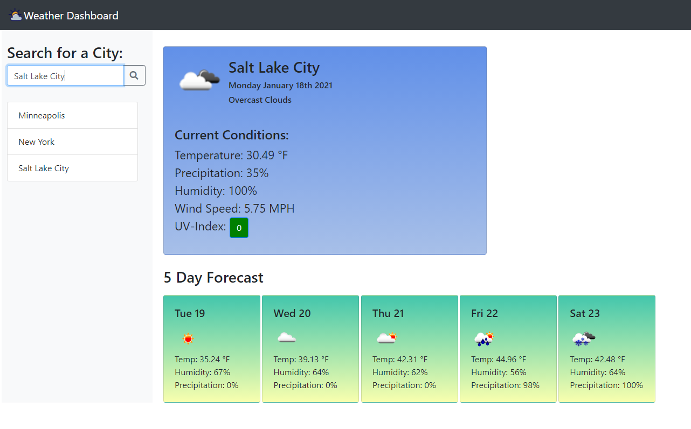

# Weather Dashboard

## Description

For this project I used JQuery, JavaScript, HTML, and CSS to create a responsive and intuitive weather dashboard.

Here are some key features:
1. A current weather dashboard that shows the city, the day, current description and icon, the temperature, precipitation, humidity, wind speed, and UV-Index.
2. A UV-Index that changes color depending the severity.
3. A five day forecast that shows the day of the week, a descriptive icon, the temperature, humidity, and precipitation.
4. A search bar where the user can search for cities to look up the weather.
5. A list of cities that is generated from the user's searches.
6. If the user enters an incorrect city an error message appears and the incorrect city is not added to the list.
7. Local storage that remembers the inputted cities and displays them when the user reloads the page.
8. The format of the page is reoriented if using a smaller screen.
9. If no local storage is available upon reload the application defaults to New York City.

## Installation

To view this website open up the index.html doc using your favorite web browser.

[Click here to access the Weather Dashboard](https://pfvatterott.github.io/Weather-Dashboard/)

## Screenshot of Main Page

## Contributing

Please feel free to offer any recommendations and to contribute yourself by forking the repository. 

## License

MIT License

Copyright (c) 2020 Paul Vatterott

Permission is hereby granted, free of charge, to any person obtaining a copy
of this software and associated documentation files (the "Software"), to deal
in the Software without restriction, including without limitation the rights
to use, copy, modify, merge, publish, distribute, sublicense, and/or sell
copies of the Software, and to permit persons to whom the Software is
furnished to do so, subject to the following conditions:

The above copyright notice and this permission notice shall be included in all
copies or substantial portions of the Software.

THE SOFTWARE IS PROVIDED "AS IS", WITHOUT WARRANTY OF ANY KIND, EXPRESS OR
IMPLIED, INCLUDING BUT NOT LIMITED TO THE WARRANTIES OF MERCHANTABILITY,
FITNESS FOR A PARTICULAR PURPOSE AND NONINFRINGEMENT. IN NO EVENT SHALL THE
AUTHORS OR COPYRIGHT HOLDERS BE LIABLE FOR ANY CLAIM, DAMAGES OR OTHER
LIABILITY, WHETHER IN AN ACTION OF CONTRACT, TORT OR OTHERWISE, ARISING FROM,
OUT OF OR IN CONNECTION WITH THE SOFTWARE OR THE USE OR OTHER DEALINGS IN THE
SOFTWARE.